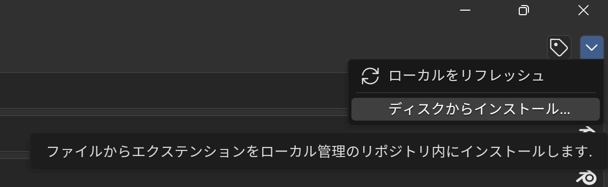
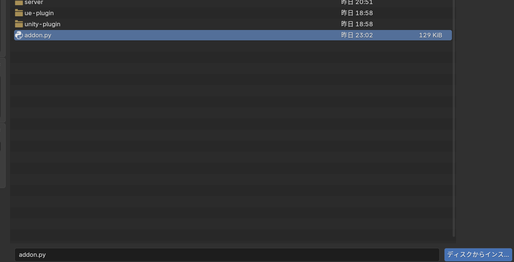
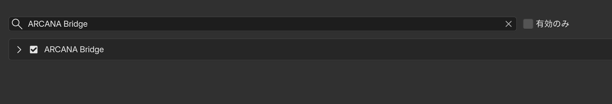
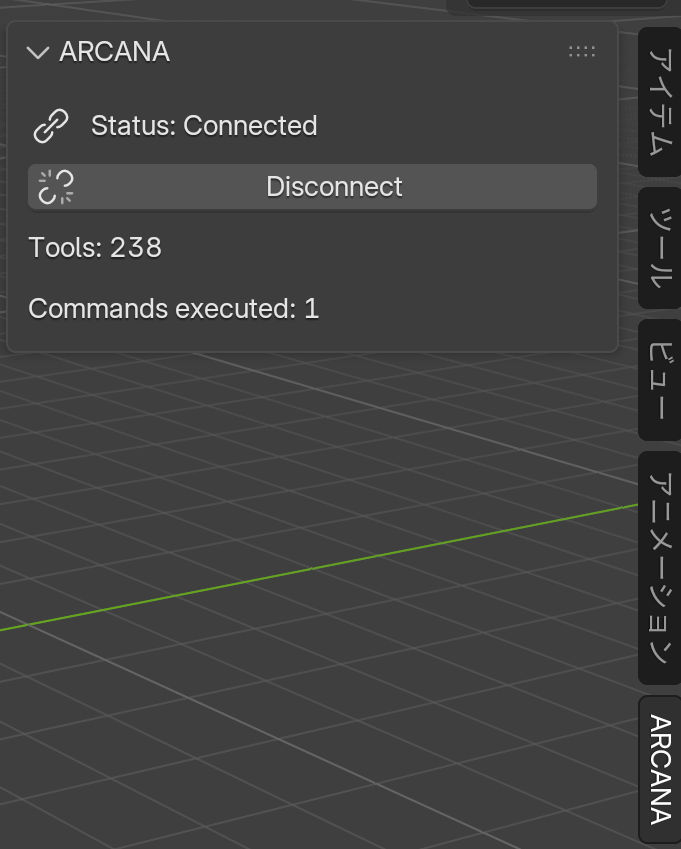

[](https://github.com/matrix9neonebuchadnezzar2199-sketch/ARCANA)

**Advanced Runtime for Creative AI & Natural-language Automation**

Control **Unity**, **Unreal Engine**, and **Blender** with natural language.
Build scenes in seconds. Create characters like a game. Free and open source, forever.

[](LICENSE) [](#tool-overview) [](#tool-overview) [](https://unity.com/) [](https://unrealengine.com/) [](https://blender.org/) [](https://nodejs.org/) [](https://modelcontextprotocol.io/)

[日本語版はこちら](README_ja.md) | English

---

## Why ARCANA?

Most MCP editor tools support one editor with 20-60 tools. ARCANA provides **832 tools across 3 editors and 94 Categories** from a single server — including **one-command scene generation** and **game-style character creation**.

|  | ARCANA | Typical MCP tool |
| --- | --- | --- |
| **Tools** | **832** | 20-60 |
| **Editors** | Unity + UE + Blender | Single editor |
| **Scene Generation** | One command | - |
| **Character Creation** | Game-style sliders | - |
| **Cross-Editor Pipeline** | Blender to Unity/UE | - |
| **SuperSave** | 4 meta-tools (~98% token saving) | - |

## Frustrated by These? ARCANA Solves Them.

<details>
<summary><strong>Click to see common pain points ARCANA eliminates</strong></summary>

#### "Setting up an FPS scene takes hours..."
```
"Create an FPS scene with terrain, lighting, post-processing, nav mesh, and 8 spawn points"
```
One command. ARCANA's **Recipe System** builds it all at once.

#### "UI layout is so tedious..."
```
"Create a main menu with title, start/options/quit buttons, and background music"
```
Canvas, buttons, event bindings, layout — all generated.

#### "I want to make a VRChat avatar but the workflow is a nightmare..."
```
"Create a 160cm female avatar with large eyes, ash hair, anime style"
"Add PhysBones to all hair chains with soft physics"
"Generate all 70+ Unified Expression shape keys"
"Validate avatar for VRChat Good rank"
```
Character body, face, hair, expressions, VRM export, VRChat setup — all via natural language.

#### "Blender to Unity export always breaks..."
```
"Export this model from Blender to Unity with correct scale and material remapping"
```
ARCANA's **Pipeline tools** handle axis conversion, scale, and material mapping automatically.

#### "I spend hours on lighting and post-processing..."
```
"Set up 3-point studio lighting with soft mood"
"Apply cinematic post-processing with bloom, color grading, and depth of field"
```
Professional setups in seconds.

#### "Project cleanup is a chore..."
```
"Run project health check — find missing references, unused assets, duplicate materials"
"Audit all textures and suggest optimizations"
```
Automated project hygiene.

</details>

## What is ARCANA?

ARCANA connects AI assistants (Claude, ChatGPT, Gemini, Copilot, Cursor) to **Unity**, **Unreal Engine**, and **Blender** via the [Model Context Protocol](https://modelcontextprotocol.io/). Describe what you want in plain language and ARCANA executes it.

## Key Features

- **832 Tools / 94 Categories** — Unity 358, Unreal Engine 192, Blender 238, Cross-Editor 40
- **3 Editor Support** — One server controls Unity, UE, and Blender simultaneously
- **Natural Language** — Describe what you want, AI does it
- **Any AI Client** — Claude Desktop, Cursor, VS Code, ChatGPT, Gemini CLI
- **SuperSave Mode** — 4 meta-tools reduce token usage ~98%
- **Bridge Architecture** — WebSocket per editor (Unity :9877, UE :9878, Blender :9879)
- **Open Source** — MIT, free forever
- **Bilingual** — English + Japanese
- **Undo Safe** — Unity tools support Undo/Redo

### Key Feature: One-Command Scene Generation

Build complete game scenes with a single natural language command. No more hours of manual setup.

| Recipe | What It Creates |
| --- | --- |
| `recipe_fps_scene` | Terrain, lighting, camera, post-processing, nav mesh, spawn points |
| `recipe_rpg_dungeon` | Rooms, corridors, doors, treasure chests, enemy spawns, boss room |
| `recipe_horror_scene` | Dark lighting, fog, ambient audio, flickering lights, jump-scare triggers |
| `recipe_open_world_base` | Large terrain, streaming zones, LOD, weather, day-night cycle |
| `recipe_vr_room` | Teleport points, grab interactables, world-space UI, guardian boundary |
| `recipe_ui_main_menu` | Title, start/options/quit buttons, background, BGM |
| `recipe_ui_hud` | Health bar, ammo counter, minimap, crosshair, score display |
| `recipe_ui_inventory` | Grid slots, drag-and-drop, item tooltip, equipment panel |
| `recipe_lighting_studio` | 3-point lighting (key, fill, rim), backdrop, reflection probe |
| `recipe_pbr_material` | Albedo, normal, metallic, roughness, AO, emission auto-configured |

Plus **project management tools**: health check, texture audit, polygon budget, naming conventions, build size report, collision matrix, quality settings, and more.


### Key Feature: 2D-to-3D --- Image to 3D World

The killer feature. Show ARCANA an illustration and it recreates the scene in 3D.

1. Paste an image (character art, landscape, concept art, game screenshot)
2. Claude Vision analyzes and extracts detailed parameters
3. ARCANA converts parameters into a tool execution pipeline
4. Your 3D editor builds everything automatically

No external AI model needed --- uses the same Vision AI you are already chatting with.

| Tool | What It Does |
| --- | --- |
| arcana_analyze_image | Extract 3D parameters from any image (preview JSON) |
| arcana_image_to_character | Image to full 3D character |
| arcana_image_to_scene | Image to full 3D scene |
| arcana_image_to_world | Image to characters + scene together |

**Example:**
```
User: [pastes fantasy landscape]  Build this scene
Claude: mountain terrain, sunset, fog, castle, lake... Executing 12 tools...
Result: Scene appears in Blender/Unity
```

### Key Feature: Game-Style Character Creation

Create and customize characters with slider-based controls — just like Monster Hunter, VRChat, or any character creator. Adjust parameters down to 1cm hair length or a specific skin tone.

<details>
<summary><strong>Character Creation Parameters (78 tools)</strong></summary>

#### Body (12 tools)
Base body generation, height (cm), proportions (shoulder/chest/waist/hip), muscle mass, body fat, arm length, leg length, hand size, foot size, neck, torso length, accessory slots.

#### Face (15 tools)
Face outline (round/oval/square/heart), jaw, cheekbone, eye shape (size/spacing/angle), eyelid (double fold), pupil (color/pattern/heterochromia), eyebrow, nose, mouth, ear (elf ears!), forehead, chin, temple, nasolabial fold, face presets (anime/realistic/chibi).

#### Hair (10 tools)
Style (17 presets: straight, wavy, curly, ponytail, twintail, bun, braids, mohawk, hime cut...), length in cm (front/side/back independently), color (22 presets: ash, platinum blonde, pink, lavender...), gradient (ombre/balayage), highlights, volume, shine, physics (PhysBone), parting, accessories (ribbon, tiara, hairpin...).

#### Material & Skin (8 tools)
Skin color (8 presets or RGB), texture (freckles/pores/aged), moles, makeup (eyeshadow/blush/lip/eyeliner/foundation), eye material, nail color (glitter, French tip), tattoos, scars.

#### Expressions (8 tools)
Unified Expressions auto-generation (70+ shape keys for VRCFaceTracking), individual shape key control, expression presets, viseme (lip-sync) setup, custom shape keys, mirror L/R, batch set, export/import expressions as JSON.

#### Export & VRChat (17 tools)
VRM export, FBX export (Unity/UE optimized), avatar validation (VRChat rank check), auto-optimization (decimate, atlas, merge), spring bone setup, Avatar Descriptor, PhysBone, Expression Menu, toggles, viseme, eye tracking, bounding box, face tracking, upload prep.

#### UE MetaHuman (8 tools)
Create MetaHuman, set face/body/hair/skin/clothing, expression presets, export (FBX/USD).

</details>

**Example workflow:**
```
"Create a 160cm female avatar, anime style, slim build"
"Set eyes large with slight upward angle, iris color violet"
"Set hair to hime cut, 25cm back length, ash blonde with pink highlights"
"Apply light makeup — pink lip, subtle blush"
"Generate all Unified Expression shape keys and visemes"
"Validate for VRChat Good rank, then export as VRM"
```

## Architecture

[](image/ARCANA%20to%20Unity%26Blender.png)

```
AI Client           MCP            ARCANA Server        Editors
Claude, Cursor  <==========>  Node.js/TypeScript  ----> Unity   :9877
ChatGPT, etc.    stdio/SSE    832 tools / 94 cat  ----> UE 5    :9878
                                                  ----> Blender :9879
```

## Tool Overview

### Unity Tools (358 tools / 53 categories)

<details>
<summary>Click to expand Unity tool list</summary>

| Category | Count | Examples |
| --- | --- | --- |
| Scene | 3 | scene_list_objects, scene_create_gameobject |
| Transform | 5 | transform_set_position, transform_set_rotation |
| Material | 5 | material_set_color, material_set_transparency |
| Lighting | 5 | lighting_create_light, lighting_set_color |
| Terrain | 4 | terrain_create, terrain_set_height |
| Audio | 3 | audio_add_source, audio_set_volume |
| Camera | 3 | camera_create, camera_set_fov |
| Physics | 3 | physics_add_rigidbody, physics_add_collider |
| VFX | 4 | vfx_create_particle, vfx_set_color |
| Animation | 4 | anim_add_animator, anim_set_parameter |
| UI | 4 | ui_create_canvas, ui_create_text |
| Optimization | 4 | opt_get_scene_stats, opt_set_static |
| Component | 4 | component_add, component_remove |
| Prefab | 3 | prefab_create, prefab_instantiate |
| Layer / Tag | 3 | layertag_set_layer, layertag_set_tag |
| Environment | 3 | env_set_skybox, env_set_fog |
| Navigation | 4 | nav_bake, nav_add_agent |
| PostProcessing | 5 | post_set_bloom, post_set_color_adjust |
| Script | 4 | script_create, script_attach |
| Selection | 4 | select_object, select_all |
| Constraint | 4 | constraint_position, constraint_rotation |
| Build | 6 | build_set_platform, build_execute |
| Render | 4 | render_screenshot, render_set_resolution |
| Asset | 5 | asset_import, asset_delete |
| Editor | 5 | editor_play_mode, editor_save_scene |
| Mesh | 6 | mesh_combine, mesh_separate |
| Timeline | 6 | timeline_create, timeline_add_track |
| Shader | 6 | shader_create_graph, shader_add_node |
| Networking | 6 | net_setup, net_spawn |
| 2D | 6 | 2d_create_sprite, 2d_create_tilemap |
| Spline | 8 | spline_create, spline_add_knot |
| Visual Scripting | 8 | vs_create_graph, vs_add_node |
| Ragdoll | 6 | ragdoll_create, ragdoll_enable |
| Cloth | 5 | cloth_add, cloth_set_params |
| Decal | 5 | decal_create, decal_set_size |
| XR / VR | 10 | xr_setup, xr_tracking |
| AI / NavAgent | 8 | ai_set_destination, ai_patrol |
| LOD | 6 | lod_create_group, lod_set_transitions |
| Gizmo | 6 | gizmo_draw_sphere, gizmo_draw_cube |
| Reflection Probe | 6 | probe_create, probe_set_size |
| Lightmap | 6 | lightmap_bake, lightmap_set_resolution |
| Occlusion | 6 | occlusion_bake, occlusion_set_occluder |
| Streaming | 6 | streaming_load_scene, streaming_unload_scene |
| Tag Manager | 4 | tagmgr_add_tag, tagmgr_add_layer |
| Screenshot | 4 | screenshot_game_view, screenshot_scene_view |
| Debug | 10 | debug_log, debug_draw_ray |
| Testing | 8 | test_create, test_run |
| Profiler | 10 | prof_cpu_start, prof_mem_snapshot |
| **Phase 5 New:** | | |
| Cinemachine | 8 | cm_create_virtual_camera, cm_set_follow_target |
| ProBuilder | 8 | pb_create_shape, pb_extrude_faces |
| Input System | 6 | input_system_create_action_map, input_system_add_action |
| Addressables | 6 | addressables_create_group, addressables_mark_asset |
| TextMeshPro | 6 | tmp_create_text, tmp_set_style |
| Tilemap | 5 | tilemap_create, tilemap_set_tiles |
| Localization | 5 | loc_add_locale, loc_create_string_table |
| VRChat | 22 | vrc_setup_avatar, vrc_add_physbone, vrc_setup_face_tracking |

</details>

### Unreal Engine Tools (192 tools / 27 categories)

<details>
<summary>Click to expand Unreal Engine tool list</summary>

| Category | Count | Examples |
| --- | --- | --- |
| UE Scene | 6 | ue_scene_list_actors, ue_scene_spawn_actor |
| UE Transform | 6 | ue_transform_set_location, ue_transform_set_rotation |
| UE Material | 8 | ue_material_create, ue_material_set_color |
| UE Lighting | 6 | ue_light_create, ue_light_set_color |
| UE Landscape | 8 | ue_landscape_create, ue_landscape_sculpt |
| UE Audio | 6 | ue_audio_add_component, ue_audio_set_volume |
| UE Camera | 6 | ue_camera_create, ue_camera_set_fov |
| UE Mesh | 6 | ue_mesh_import, ue_mesh_set_collision |
| UE Blueprint | 10 | ue_bp_create, ue_bp_add_component |
| UE Animation | 6 | ue_anim_import, ue_anim_play |
| UE UI / UMG | 6 | ue_ui_create_widget, ue_ui_add_text |
| UE AI | 8 | ue_ai_create_bt, ue_ai_create_bb |
| UE Physics | 6 | ue_physics_enable, ue_physics_set_mass |
| UE Build | 6 | ue_build_set_platform, ue_build_package |
| UE Level | 6 | ue_level_create, ue_level_open |
| UE Foliage | 6 | ue_foliage_add_type, ue_foliage_paint |
| **Phase 5 New:** | | |
| UE Niagara VFX | 10 | ue_niagara_create_system, ue_niagara_add_emitter |
| UE UMG Widget | 8 | ue_umg_create_widget, ue_umg_add_element |
| UE Sequencer | 8 | ue_sequencer_create_sequence, ue_sequencer_add_track |
| UE Enhanced Input | 6 | ue_einput_create_action, ue_einput_create_mapping |
| UE PCG | 6 | ue_pcg_create_graph, ue_pcg_add_point_sampler |
| UE MetaSound | 5 | ue_metasound_create, ue_metasound_add_node |
| UE Control Rig | 5 | ue_controlrig_create, ue_controlrig_add_control |
| UE MetaHuman | 8 | ue_metahuman_create, ue_metahuman_set_face |

</details>

### Blender Tools (238 tools / 27 categories)

<details>
<summary>Click to expand Blender tool list</summary>

| Category | Count | Examples |
| --- | --- | --- |
| BL Object | 10 | bl_object_create, bl_object_delete |
| BL Mesh | 10 | bl_mesh_edit_vertices, bl_mesh_extrude_faces |
| BL Material | 8 | bl_material_create, bl_material_set_color |
| BL Modifier | 10 | bl_mod_subsurf, bl_mod_mirror |
| BL Sculpt | 8 | bl_sculpt_set_brush, bl_sculpt_set_strength |
| BL Animation | 10 | bl_anim_insert_keyframe, bl_anim_create_bone |
| BL Camera | 6 | bl_camera_create, bl_camera_set_focal |
| BL Light | 6 | bl_light_create, bl_light_set_color |
| BL Render | 10 | bl_render_set_engine, bl_render_set_resolution |
| BL Scene | 8 | bl_scene_list, bl_scene_create |
| BL Node | 10 | bl_node_add, bl_node_connect |
| BL UV | 8 | bl_uv_unwrap, bl_uv_smart_project |
| BL Particle | 8 | bl_particle_add, bl_particle_add_hair |
| BL Armature | 10 | bl_armature_create, bl_armature_add_bone |
| BL Grease Pencil | 8 | bl_gp_create, bl_gp_add_layer |
| **Phase 5 New:** | | |
| BL Geometry Nodes | 10 | bl_geonodes_create_tree, bl_geonodes_add_node |
| BL Compositor | 7 | bl_comp_enable, bl_comp_add_node |
| BL Grease Pencil+ | 6 | bl_gp_set_brush_advanced, bl_gp_create_frame |
| BL Sculpting+ | 6 | bl_sculpt_dyntopo, bl_sculpt_mask |
| BL Texture Paint | 5 | bl_texpaint_enable, bl_texpaint_set_brush |
| BL Video Sequence | 6 | bl_vse_add_strip, bl_vse_cut |
| **Character Creation:** | | |
| BL Character Body | 12 | bl_char_create_base, bl_char_set_height |
| BL Character Face | 15 | bl_char_set_eye_shape, bl_char_set_nose |
| BL Character Hair | 10 | bl_char_set_hair_style, bl_char_set_hair_color |
| BL Character Material | 8 | bl_char_set_skin_color, bl_char_set_makeup |
| BL Character Expression | 8 | bl_char_create_unified_shapekeys, bl_char_setup_viseme |
| BL Character Export | 5 | bl_char_export_vrm, bl_char_validate_avatar |

</details>

### Cross-Editor & Recipe Tools (40 tools / 3 categories)

<details>
<summary>Click to expand Cross-Editor tool list</summary>

| Category | Count | Examples |
| --- | --- | --- |
| Recipe Scene | 15 | recipe_fps_scene, recipe_rpg_dungeon, recipe_horror_scene, recipe_ui_main_menu |
| Recipe Project | 15 | project_health_check, project_texture_audit, project_polygon_budget |
| Recipe Pipeline | 10 | pipeline_blender_to_unity, pipeline_animation_retarget, pipeline_lod_generator |

</details>

## SuperSave Mode

Instead of registering all 832 tools, SuperSave exposes only **4 meta-tools**:

| Meta-Tool | Purpose |
| --- | --- |
| arcana.discover | Search tools by keyword or category |
| arcana.inspect | Get full schema for a specific tool |
| arcana.execute | Run any tool by ID with parameters |
| arcana.compose | Chain multiple tools into a pipeline |

Token usage reduced by approximately **98%**.

## Quick Start

### Step 0: Prerequisites (All Free)

```
Setup Flow:

  Step 0: Prerequisites
  Node.js + Git + 3D Editor
         |
         |---> Option A: Try Completely Free (Claude Desktop)
         |     Recommended for beginners.
         |     Just install and go. No API key needed.
         |
         +---> Option B: Use with Other AI Clients
               For Cursor / VS Code / Gemini CLI users.
```

**1. Node.js** (Required for ARCANA server)

- Download LTS version from [nodejs.org](https://nodejs.org/)
- Run the installer (all default settings are fine)
- Verify: open your terminal and type `node --version`

**2. Git** (Required to download ARCANA)

- **Windows**: Download from [git-scm.com](https://git-scm.com/download/win) and install
- **Mac**: Open Terminal and run `xcode-select --install`
- **Linux**: Run `sudo apt install git` (Ubuntu/Debian) or `sudo dnf install git` (Fedora)
- Verify: `git --version`

**3. A 3D Editor** (At least one of the following)

| Editor | Cost | Account Needed? | Install Size | Best For |
|--------|------|-----------------|-------------|----------|
| **Blender 4.2+** | Free | No | ~500 MB | Beginners, character creation, VRChat |
| **Unity 2022.3+** | Free (Personal) | Yes (Unity ID) | ~5 GB | Game development |
| **UE 5.x** | Free | Yes (Epic Games) | ~60 GB | High-end visuals, AAA games |

> **First time? Start with Blender.** Download from [blender.org/download](https://www.blender.org/download/), install, done. No account, no sign-up.

---

### Option A: Try Completely Free with Claude Desktop (Recommended)

> **Cost: $0.** Claude Desktop is Anthropic's free AI app with built-in MCP support.
> No API key needed — just install and go.

#### Overview: Setup Flow

```
1.Install Claude Desktop ......... Step 1
2.Build ARCANA ................... Step 2 (Clone & Build)
3.Configure MCP .................. Step 3 (claude_desktop_config.json)
4.Set Up Blender ................. Step 4 (addon.py -> Install from Disk)
5.Start Creating! ................ Step 5 (Talk to AI, build 3D scenes)
```

#### Step 1: Install Claude Desktop
Download from [claude.com/download](https://claude.com/download) and install. Create a free Anthropic account if you don't have one.

```

#### Step 2: Download and Build ARCANA


```bash
git clone https://github.com/matrix9neonebuchadnezzar2199-sketch/ARCANA.git
cd ARCANA/server
npm install
npm run build
```

#### Step 3: Configure MCP Connection

> **Important:** The config file **must be UTF-8 without BOM**. The commands below handle this automatically.

**Windows (PowerShell) — Standard install:**

```powershell
$configDir = "$env:APPDATA\Claude"
if (!(Test-Path $configDir)) { New-Item -ItemType Directory -Path $configDir -Force }
$json = '{"mcpServers":{"arcana":{"command":"node","args":["C:\\full\\path\\to\\ARCANA\\server\\dist\\index.js"],"timeout":30000}}}'
[System.IO.File]::WriteAllText("$configDir\claude_desktop_config.json", $json, (New-Object System.Text.UTF8Encoding $false))
```

****Windows (PowerShell) — Microsoft Store install:**

```powershell
$configDir = "$env:LOCALAPPDATA\Packages\Claude_pzs8sxrjxfjjc\LocalCache\Roaming\Claude"
if (!(Test-Path $configDir)) { New-Item -ItemType Directory -Path $configDir -Force }
$json = '{"mcpServers":{"arcana":{"command":"node","args":["C:\\full\\path\\to\\ARCANA\\server\\dist\\index.js"],"timeout":30000}}}'
[System.IO.File]::WriteAllText("$configDir\claude_desktop_config.json", $json, (New-Object System.Text.UTF8Encoding $false))
```

**Mac / Linux:**

```bash
mkdir -p ~/Library/Application\ Support/Claude
echo '{"mcpServers":{"arcana":{"command":"node","args":["/full/path/to/ARCANA/server/dist/index.js"],"timeout":30000}}}' > ~/Library/Application\ Support/Claude/claude_desktop_config.json
```

Replace the path with your actual ARCANA directory. After saving, restart Claude Desktop completely (quit and reopen).

Verify: Start a new chat and type: Check ARCANA connection status

Troubleshooting:

･Config read error: File has a BOM. Use the PowerShell commands above.
･"Unexpected token" errors: Run npm run build again after latest source changes.
･No MCP tools: Verify path points to dist/index.js, not src/index.ts. Use absolute paths.

#### Step 4: Set Up Your Editor Plugin

<details>
<summary><strong>Blender (Recommended for beginners)</strong></summary>

> **Single-file install:** Just download one file and install. No folder copying needed.

#### Install from Disk (All Blender versions)

1. Download [`addon.py`](addon.py) from this repository
2. Open Blender
3. Go to **Edit > Preferences > Add-ons**
   - **Blender 4.2+/5.x:** Click the dropdown arrow, select **"Install from Disk"**
   - **Blender 3.6-4.1:** Click **"Install..."**
4. Select the downloaded `addon.py` file

   
   
5. Enable **ARCANA Bridge** by checking the box
   - **Blender 4.2+/5.x:** Look under the **"Legacy Add-ons"** section

   
6. Press **N** in the 3D Viewport, click the **ARCANA** tab, press **Connect**

   


> **Note:** ARCANA's MCP server must be running for Connect to work. If your AI client starts it automatically, great. Otherwise run `node dist/index.js` from the server directory.

</details>

<details>
<summary><strong>Unity</strong></summary>

1. Open your Unity project
2. Drag the `unity-plugin` folder into your project's Assets folder
3. Go to **Tools > ARCANA > Setup**

</details>

<details>
<summary><strong>Unreal Engine</strong></summary>

1. Copy `ue-plugin/ARCANA` into your project's Plugins directory
2. Open UE > **Edit > Plugins** > Enable ARCANA
3. Restart the editor

</details>

#### Step 5: Start Creating!

Open a new chat in Claude Desktop and just talk:

```
> Create a red cube at position 2, 0, 0
> Build an FPS scene with snowy terrain and sunset lighting
> Create a 160cm anime-style female character with large eyes and ash blonde hair
```

> **Tip: If the AI reads files instead of calling MCP tools, be explicit:
> ```
> Use arcana_execute to run bl_object_create with params {"type": "CUBE", "name": "MyCube", "location": [2, 0, 0]}
> ```

**Free AI + Free Editor + Free ARCANA = Unlimited creativity.**

---

### Option B: Use with Other AI Clients

> For Cursor, VS Code, Gemini CLI, or other MCP-compatible clients.

#### Step 1: Download and Build ARCANA

```bash
git clone https://github.com/matrix9neonebuchadnezzar2199-sketch/ARCANA.git
cd ARCANA/server
npm install
npm run build
```

#### Step 2: Configure Your AI Client

Copy the config for your client. Replace `PATH_TO` with your actual ARCANA path.

**Cursor** (`.cursor/mcp.json`):

```json
{
  "mcpServers": {
    "arcana": {
      "command": "node",
      "args": ["./server/dist/index.js"],
      "cwd": "PATH_TO/ARCANA"
    }
  }
}
```

**VS Code** (`.vscode/settings.json`):

```json
{
  "mcp": {
    "servers": {
      "arcana": {
        "command": "node",
        "args": ["./server/dist/index.js"],
        "cwd": "PATH_TO/ARCANA"
      }
    }
  }
}
**Gemini CLI:**

```bash
gemini mcp add arcana -- node /full/path/to/ARCANA/server/dist/index.js
```


See also: `claude_desktop_config.example.json`, `cursor_mcp_config.example.json`, `vscode_mcp_config.example.json` in the repository root.

#### Step 3: Set Up Your Editor Plugin

Same as Option A Step 5 above. Install the plugin for your editor (Blender / Unity / UE).

#### Step 4: Try It

**Scene Generation:**

```
"Create an FPS scene with snowy terrain and dramatic lighting"
"Build an RPG dungeon with 10 rooms, ice theme, and a boss room"
```

**Character Creation:**

```
"Create a character with height 175cm, athletic build"
"Set hair to wavy, 30cm, ash color with lavender highlights"
"Make eyes larger and add violet irises"
```

**2D to 3D:**

```
"[paste illustration] Build this scene in 3D"
"[paste character art] Create this character"
```


## Roadmap

| Phase | Status | Content |
| --- | --- | --- |
| 1 | Done | Core MCP server, SuperSave, Bridge architecture |
| 2 | Done | Unity 302 tools (46 categories) |
| 3 | Done | Unreal Engine 136 tools (20 categories) |
| 4 | Done | Blender 140 tools (15 categories) |
| 5 | **Done** | **832 tools, Recipe system, Character creation, Cross-editor pipeline** |
| 6 | **Done** | **UE C++ plugin, Blender Python addon, WebSocket bridge, AI client configs** |
| 7 | Next | End-to-end testing, CI/CD, community recipes |

## Contributing

See [CONTRIBUTING.md](CONTRIBUTING.md) for guidelines. All skill levels welcome.

## License

MIT License. See [LICENSE](LICENSE) for details.
